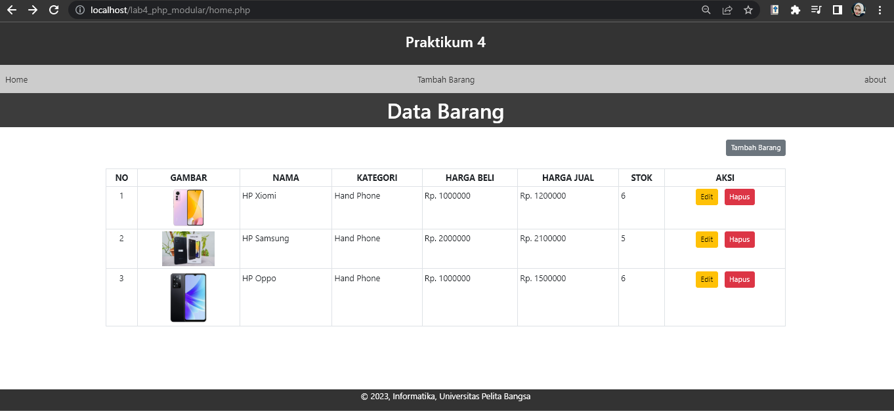
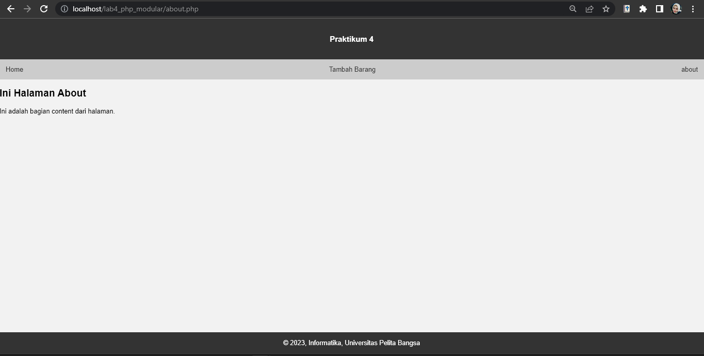
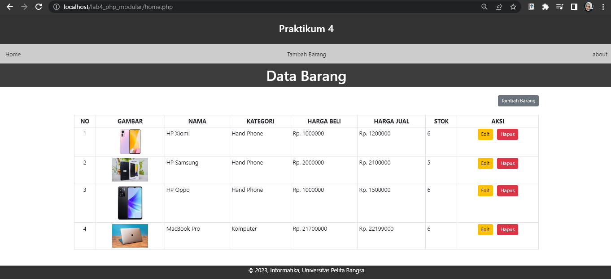

# Lab4Web

### Pada pratikum ini merupakan modifikasi dari pratikum 3 dengan menambahkan file header.php, footer.php, menu home dan menu about. Berikut merupakan langkah-langkahnya.

>Buat file baru dengan nama header.php
```
<!DOCTYPE html>
<html lang="en">

<head>
    <meta charset="UTF-8">
    <title>Contoh Modularisasi</title>
    <link href="style.css" rel="stylesheet" type="text/stylesheet" media="screen" />
    <style>
        body {
            margin: 0;
            padding: 0;
            font-family: Arial, sans-serif;
            background-color: #f2f2f2;
        }
        .container {
            width: 80%;
            margin: 0 auto;
        }
        header {
            background-color: #333;
            color: #fff;
            padding: 20px;
            text-align: center;
        }
        nav {
            background-color: #ccc;
            padding: 10px;
            display: flex;
            justify-content: space-between;
            align-items: center;
        }
        nav a {
            color: #333;
            text-decoration: none;
            padding: 5px;
        }
        nav a:hover {
            color: #fff;
            background-color: #333;
        }
        footer {
            position: fixed;
            left: 0;
            bottom: 0;
            width: 100%;
            padding: 0;
            background-color: #333;
            color: #fff;
            text-align: center;
        }
    </style>
</head>
<body>
    
        <header>
            <h3>Praktikum 4</h3>
        </header>
        <nav>
            <a href="home">Home</a>
            <a href="tambah">Tambah Barang</a>
            <a href="about.php">about</a>
        </nav>
```

> Dan lakukan hal yang sama dengan memberi nama file footer.php
```
<footer>
    <p>&copy; 2023, Informatika, Universitas Pelita Bangsa</p>
</footer>
</div>
</body>

</html>
```
> Membuat file baru dengan nama home.php
<?php require('header.php'); ?>
<?php

// memanggil koneksi database
require_once("koneksi.php");

// query untuk menampilkan data barang
$sql = "SELECT * FROM data_barang";
$result = mysqli_query($conn, $sql);

$no = 1;
?>

<!DOCTYPE html>
<html>

<head>
    <title>Data Barang</title>
    <link rel="stylesheet" href="https://cdn.jsdelivr.net/npm/bootstrap@5.2.0-beta1/dist/css/bootstrap.min.css" />
</head>

<body>
    <h1 class="py-2 px-3 text-center" style="background-color: #3c3c3c; color: white;">Data Barang</h1>

    <div class="container">
        <div class="mt-4">
            <a href="tambah.php" class="btn btn-secondary btn-sm mb-4 float-end">Tambah Barang</a>
            <table class="table table-sm table-bordered">
                <tr class="text-center fw-bold text-uppercase">
                    <th>No</th>
                    <th>Gambar</th>
                    <th>Nama</th>
                    <th>Kategori</th>
                    <th>Harga Beli</th>
                    <th>Harga Jual</th>
                    <th>Stok</th>
                    <th>Aksi</th>
                </tr>
                <?php while ($row = mysqli_fetch_assoc($result)) { ?>
                    <tr>
                        <td class="text-center"><?php echo $no;
                                                $no++ ?></td>
                        <td class="text-center">"  alt="<?= $row['nama']; ?>" width="100px" /></td>
                        <td><?php echo $row['nama']; ?></td>
                        <td><?php echo $row['kategori']; ?></td>
                        <td>Rp. <?php echo $row['harga_beli']; ?></td>
                        <td>Rp. <?php echo $row['harga_jual']; ?></td>
                        <td><?php echo $row['stok']; ?></td>
                        <td class="text-center">
                            <a href="ubah.php?id=<?php echo $row['id_barang']; ?>" class="btn btn-warning btn-sm mx-1">Edit</a>
                            <a href="hapus.php?id=<?php echo $row['id_barang']; ?>" class="btn btn-danger btn-sm mx-1" onclick="return confirm('Apakah Anda yakin ingin menghapus barang ini?')">Hapus</a>
                        </td>
                    </tr>
                <?php } ?>
            </table>
        </div>
    </div>
</body>
</html>
<div style="text-align:center;">
  <?php require('footer.php'); ?>
</div>

> Akan muncul tampilan seperti gambar dibawah ini


> Membuat file baru dengan nama about.php
```
<?php require('header.php'); ?>
<div class="content">
    <h2>Ini Halaman About</h2>
    <p>Ini adalah bagian content dari halaman.</p>
</div>
<?php require('footer.php'); ?>
```
> Berikut adalah tampilan dari about.php


### Membuat routing 
> Dengan menambahkan file baru yaitu index.php. Routing digunakan untuk mempermudah akses halaman web agar SEO Friendly.
```
<?php

$mod = @$_REQUEST['mod'];

switch ($mod) {
    case "home":
        require("home.php");
        break;
    case "tambah":
        require("tambah.php");
        break;
    default:
        require("home.php");
}
?>
```
### Aktivasi mod_rewrite
>Mod_rewrite digunakan untuk mengubah URL dari query string menjadi SEO Friendly.
Langkah awal yang harus disiapkan adalah aktivasi mod_rewrite pada webserver Apache2 pada
configurasi httpd.conf.
> Selanjutnya membuat file .htaccess
```
<IfModule mod_rewrite.c>
    RewriteEngine On
    RewriteBase /LAB4_PHP_MODULAR/

    RewriteCond %{REQUEST_FILENAME} !-f
    RewriteCond %{REQUEST_FILENAME} !-d
    RewriteRule ^(.*)$ index.php?mod=$1 [L]
</IfModule>
```
> Berikut adalah tampilan untuk menambahkan barang

> Berikut adalah tampilan pada menu home setelah ditambahkan MacBook Pro.
